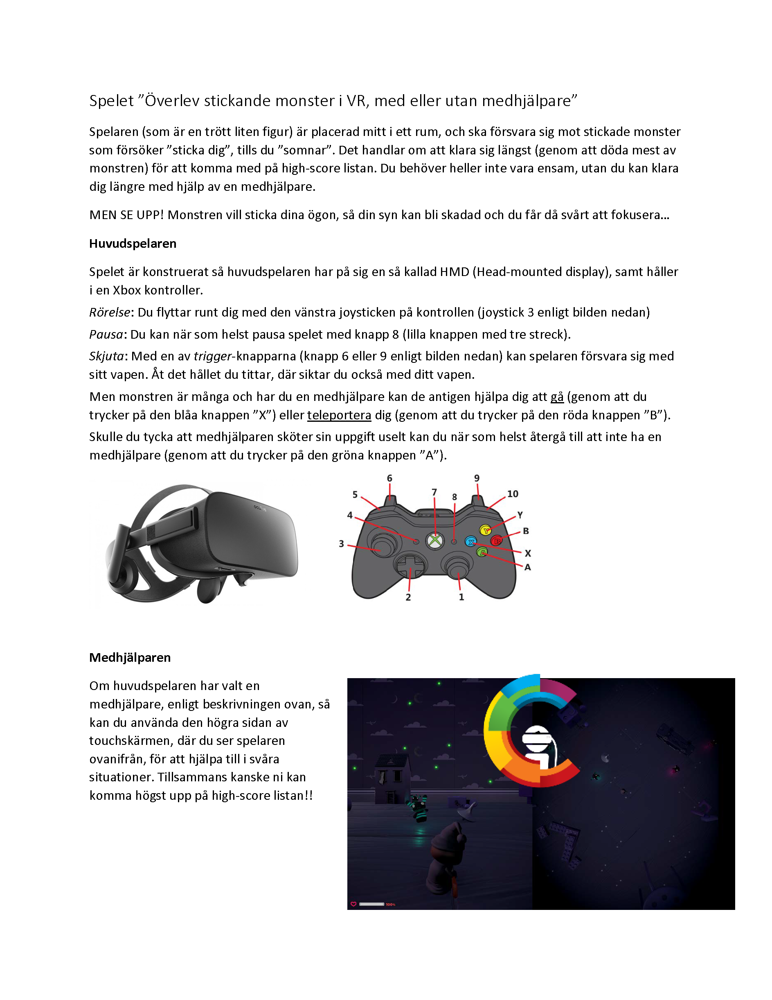

UnitySurvivalShooterVRTouchHybrid
===========

Based on the free Unity Survival Shooter example: https://unity3d.com/learn/tutorials/projects/survival-shooter-tutorial

Additions/changes:

 - Scene that utilizes VR Tracking to rotate the character and cameras with third-person view and "god" view.
 - Two modes for co-op, where an assistant can help the player with the HMD to escape the enemies, by touching in the "god" view.
 - KinoIsoline effect on camera when only half of health is left.
 - Xbox contoller for shooting, movement of VR camera, and mode changes.
 - High-Score functionality (with on-screen touch/non-touch keyboard)

